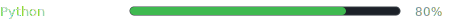
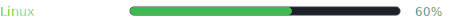

  <h1>Rodrigo Dalavia Fechner</h1>
  

    
  

### 👨‍💻 Sobre mim

Olá, prazer me chamo **Rodrigo** e atuo como **DevOps**. Minha trajetória começou em redes e infraestrutura, mas acabei descobrindo automações e decidi unir os dois mundos. Atualmente trabalho com desenvolvimento de automações em **Python** e também com infraestrutura, redes e servidores. Meu objetivo é entregar resultados valiosos automatizando processos ou dando suporte a sistemas legados.

---

### 🛠️ Stack Tecnológica

<table width="100%">
  <tr>
    <td width="50%" valign="top">
      <b>🤖 Automação & RPA</b>  
      
      
      
      
      
      
      
    </td>
    <td width="50%" valign="top">
      <b>🌐 Redes & Infra</b>  
      
      
      
      
      
      
      
    </td>
  </tr>
  <tr>
    <td width="50%" valign="top">
      <b>🗄️ Banco de Dados</b>  
      
      
      
      
    </td>
    <td width="50%" valign="top">
      <b>🔧 Ferramentas</b>  
      
      
      
      
    </td>
  </tr>
</table>

---

### 📊 Nível de Habilidades

   
   
   
   
   
   
  

---

### 🎓 Certificações e Qualificações

- 📜 **Jornada Python** — Hashtag (05/2026)
- 🌐 **Redes TCP/IP** — Udemy (12/2024)
- 🐧 **Linux** — Udemy (05/2025)
- 🟨 **Yellow Belt Certified** — Desenvolvimento Profissional & Melhoria Contínua

---

### 📬 Contato

  
  
  

